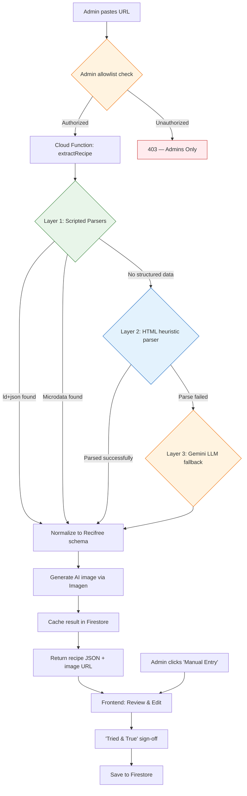
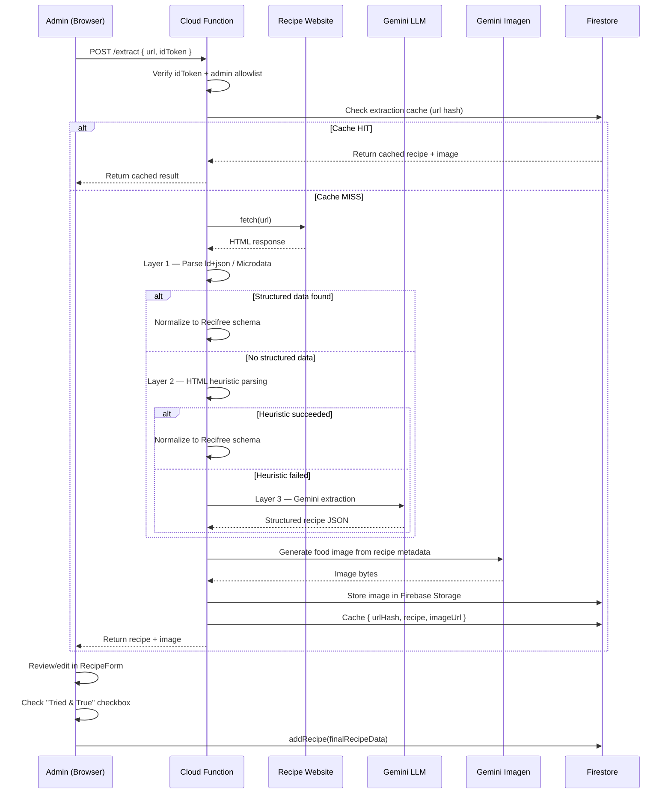
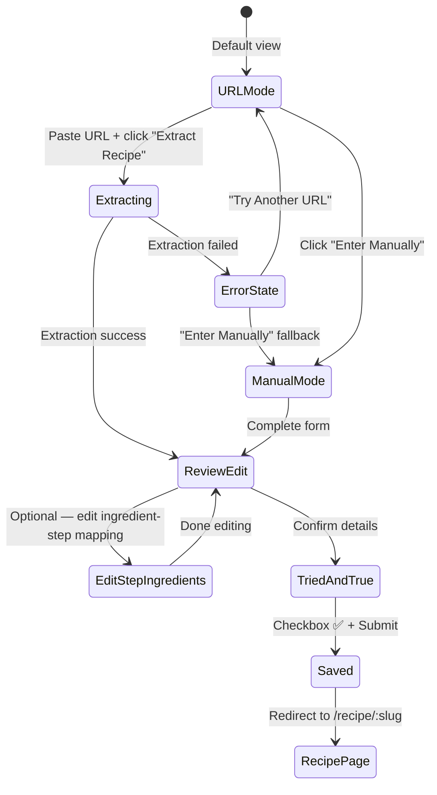

# Phase 2: The Extraction Engine — Implementation Plan

> **Status:** 🟡 In Planning  
> **Last Updated:** 2026-05-03  
> **Goal:** Enable admin users to paste a recipe URL and receive a clean, ad-free recipe card — or manually enter one — with AI-generated images and full source attribution.

---

## Key Decisions

| Decision | Resolution |
|----------|-----------|
| LLM Provider | **Google Gemini** (via `@google/generative-ai`) |
| Image Generation | **Google Gemini Imagen** (same ecosystem, unified billing) |
| Who can upload? | **Admin-only** via allowlist (initially `benjamin.daprile@gmail.com`) |
| Cloud Function billing | **Shared `maxInstances: 3`** with existing SSR function — monitor and adjust |
| Primary extraction strategy | **Robust scripted parsers first** — LLM is backup only |
| stepIngredients | LLM attempts extraction; users can manually edit/add in review form |

---

## Architecture Overview



### Three-Layer Parsing Strategy

The extraction pipeline uses **scripted parsers first** and only falls back to the LLM when scripts fail. This minimizes Gemini API costs.

| Layer | Method | Cost | When Used |
|-------|--------|------|-----------|
| **1. Structured Data** | Parse `application/ld+json` and Microdata `@type: Recipe` | Free | ~70% of recipe sites embed this for Google SEO |
| **2. HTML Heuristics** | Pattern-match common recipe plugin HTML structures (WPRM, Tasty, etc.) | Free | Sites without schema but using popular WordPress plugins |
| **3. Gemini LLM** | Send sanitized text to Gemini with strict system prompt | ~$0.001–0.01/call | Last resort when scripted parsing fails |

---

## Data Flow



---

## Task Breakdown

8 tasks ordered by dependency. Each is designed to be implemented by a separate agent, merged independently, and tested in isolation.

### Progress Tracker

| # | Task | Status | Depends On |
|---|------|--------|------------|
| 1 | [Extraction Cloud Function (Backend Core)](#task-1-extraction-cloud-function-backend-core) | ⬜ Not Started | — |
| 2 | [Prompt Security & Admin Gating](#task-2-prompt-security--admin-gating) | ⬜ Not Started | Task 1 |
| 3 | [Global Extraction Cache](#task-3-global-extraction-cache) | ⬜ Not Started | Task 1 |
| 4 | [AI Image Generation Engine](#task-4-ai-image-generation-engine) | ⬜ Not Started | Task 1 |
| 5 | [Add Recipe Page — Frontend](#task-5-add-recipe-page--frontend) | ⬜ Not Started | Tasks 1, 3, 4 |
| 6 | ["Tried & True" Sign-Off UX](#task-6-tried--true-sign-off-ux) | ⬜ Not Started | Task 5 |
| 7 | [Source Attribution Component](#task-7-source-attribution-component) | ⬜ Not Started | Task 5 |
| 8 | [Integration Testing & Polish](#task-8-integration-testing--polish) | ⬜ Not Started | All |

---

### Task 1: Extraction Cloud Function (Backend Core)
**Priority:** 🔴 Critical Path  
**Estimated Complexity:** Large  
**Status:** ⬜ Not Started

#### Scope
Build the `extractRecipe` Cloud Function with a **three-layer parsing pipeline**:

**Layer 1 — Structured Data Parser (scripted, free):**
- Parse HTML for `<script type="application/ld+json">` tags
- Find objects with `@type: "Recipe"` (handle `@graph` arrays too)
- Extract: name, description, ingredients (`recipeIngredient`), instructions (`recipeInstructions`), times, yield, image, author, nutrition
- Also check for **Microdata** (`itemscope itemtype="https://schema.org/Recipe"`) as a secondary structured source

**Layer 2 — HTML Heuristic Parser (scripted, free):**
- Target common WordPress recipe plugin HTML structures:
  - **WPRM** (WP Recipe Maker): `.wprm-recipe-container`, `.wprm-recipe-ingredient`, `.wprm-recipe-instruction`
  - **Tasty Recipes**: `.tasty-recipes-entry-content`
  - **Recipe Card Blocks**: `.recipe-card-*`
- Generic fallback: look for `<ul>` near headings containing "ingredient" and `<ol>` near "instruction/direction/step"
- Parse ingredient strings into `{ amount, unit, item }` using regex patterns for common formats (e.g., `"1 1/2 cups flour"`)

**Layer 3 — Gemini LLM Fallback (API cost, last resort):**
- Send sanitized visible text to Gemini with the strict system prompt from `RECIPE_GENERATION.md`
- Only triggered when both Layer 1 and Layer 2 fail
- Log which layer succeeded for monitoring API usage

**Schema Mapper (shared across all layers):**
- Normalize output from any layer into the exact Recifree JSON schema (matching `src/data/recipes/*.json`)
- Parse ingredient strings → `{ amount, unit, item }` objects
- Generate `stepIngredients` mapping by cross-referencing instruction text with ingredient items
- Generate slug from title

#### Files to Create/Modify
| File | Action | Purpose |
|------|--------|---------|
| `functions/extractRecipe.js` | **Create** | Cloud Function endpoint & orchestration |
| `functions/parsers/ldJsonParser.js` | **Create** | Layer 1: ld+json / structured data extraction |
| `functions/parsers/microdataParser.js` | **Create** | Layer 1b: Microdata extraction |
| `functions/parsers/heuristicParser.js` | **Create** | Layer 2: HTML pattern matching for common recipe plugins |
| `functions/parsers/ingredientParser.js` | **Create** | Parse raw ingredient strings → `{ amount, unit, item }` |
| `functions/parsers/stepIngredientMapper.js` | **Create** | Cross-reference instructions with ingredients to build `stepIngredients` |
| `functions/parsers/llmParser.js` | **Create** | Layer 3: Gemini LLM fallback |
| `functions/parsers/schemaMapper.js` | **Create** | Normalize any parsed output → Recifree JSON schema |
| `functions/index.js` | **Modify** | Register new function export |
| `functions/package.json` | **Modify** | Add `node-html-parser`, `@google/generative-ai` |

#### Key Design Decisions
- **`node-html-parser`** for HTML parsing — lightweight, no browser engine, fast cold starts
- **Ingredient string parser** must handle: fractions (`1/2`, `1 1/2`), Unicode fractions (`½`), ranges (`2-3`), parenthetical notes (`(about 2 cups)`)
- **stepIngredients mapper** uses text-matching: scan each instruction for ingredient item names, building the index array. This is inherently fuzzy — it's a best-effort that users refine in the review step
- **Gemini API key** stored in Firebase Secret Manager, accessed via `process.env.GEMINI_API_KEY`
- Output includes a `_extractionMeta` field: `{ method: "ld+json" | "microdata" | "heuristic" | "llm", parsedAt: timestamp }` for debugging/monitoring
- Shared `maxInstances: 3` with `ssrRecipe`

#### Acceptance Criteria
- [ ] Function accepts `POST { url, idToken }` and returns Recifree-schema JSON
- [ ] Layer 1 extracts from sites with valid ld+json (e.g., AllRecipes, Serious Eats)
- [ ] Layer 2 extracts from sites using WPRM or Tasty Recipes plugins
- [ ] Layer 3 falls back to Gemini when both scripted layers fail
- [ ] `ingredientParser` correctly handles fractions, units, and item names
- [ ] `stepIngredientMapper` produces reasonable ingredient-step associations
- [ ] Returns clear error responses (400 bad URL, 422 unparseable, 500 internal)
- [ ] Gemini API key in Secret Manager — never hardcoded
- [ ] Unit tests for every parser module
- [ ] `_extractionMeta.method` correctly reflects which layer was used

---

### Task 2: Prompt Security & Admin Gating
**Priority:** 🔴 Critical Path  
**Estimated Complexity:** Medium  
**Status:** ⬜ Not Started  
**Depends on:** Task 1

#### Scope
1. **Admin allowlist:** Verify the requesting user's email is in an authorized list before processing
2. **URL validation:** Reject non-HTTP(S), localhost, private IPs, and overly long URLs
3. **Content sanitization:** Strip scripts, styles, and hidden text before LLM processing
4. **Prompt injection defense:** Wrap the Gemini system prompt with sandwich defense
5. **Rate limiting:** Per-user extraction limit (10/hour) even for admins
6. **Response validation:** Validate Gemini output against recipe schema

#### Admin Gating Implementation
```javascript
// Firestore: app_config/admin_users
{
  allowlist: ["benjamin.daprile@gmail.com"]
}
```
- Check the authenticated user's email against the Firestore allowlist
- Return `403 Forbidden` with a user-friendly message for non-admins
- This is designed to be easily expandable later when we open up uploads to all users

#### Files to Create/Modify
| File | Action | Purpose |
|------|--------|---------|
| `functions/security/adminGate.js` | **Create** | Admin allowlist verification |
| `functions/security/urlValidator.js` | **Create** | URL validation & SSRF prevention |
| `functions/security/contentSanitizer.js` | **Create** | Strip dangerous HTML before LLM |
| `functions/security/promptGuard.js` | **Create** | Prompt injection sandwich defense |
| `functions/security/rateLimiter.js` | **Create** | Per-user rate limiting (Firestore-backed) |
| `functions/security/schemaValidator.js` | **Create** | Validate LLM output against recipe schema |
| `functions/extractRecipe.js` | **Modify** | Integrate security pipeline |

#### Acceptance Criteria
- [ ] `benjamin.daprile@gmail.com` is authorized; other emails get 403
- [ ] Allowlist lives in Firestore (not hardcoded) for easy updates
- [ ] Invalid/private/SSRF URLs rejected with 400
- [ ] Hidden content stripped before LLM processing
- [ ] Rate limit returns 429 after 10 extractions/hour
- [ ] Gemini output validated against recipe JSON schema
- [ ] Unit tests for all security modules

---

### Task 3: Global Extraction Cache
**Priority:** 🟡 High — primary cost control  
**Estimated Complexity:** Small  
**Status:** ⬜ Not Started  
**Depends on:** Task 1

#### Scope
Firestore-based cache so the same URL never triggers duplicate API calls. This is the #1 cost-saving mechanism.

#### Data Model
```javascript
// Firestore: extraction_cache/{urlHash}
{
  urlHash: "sha256-of-normalized-url",
  originalUrl: "https://example.com/recipe/chicken-soup",
  recipe: { /* full Recifree JSON schema */ },
  imageUrl: "https://storage.googleapis.com/.../extracted-images/abc123.png",
  extractedAt: Timestamp,
  extractionMethod: "ld+json" | "microdata" | "heuristic" | "llm",
  hitCount: 0
}
```

#### Files to Create/Modify
| File | Action | Purpose |
|------|--------|---------|
| `functions/cache/extractionCache.js` | **Create** | Cache read/write/URL normalization |
| `functions/extractRecipe.js` | **Modify** | Check cache before extraction, write after |

#### Key Design Decisions
- **URL normalization** before hashing: lowercase host, strip `utm_*`/tracking params, remove trailing slashes, remove `www.` prefix
- Cache is **write-once** — no updates, no TTL for now
- `hitCount` increments on cache hit for usage analytics

#### Acceptance Criteria
- [ ] Cache hit returns immediately without any fetch/parse/API calls
- [ ] Cache miss triggers extraction, then writes result
- [ ] URL normalization handles `www`, trailing slashes, tracking params
- [ ] `hitCount` increments correctly
- [ ] Unit tests for normalization + read/write

---

### Task 4: AI Image Generation Engine
**Priority:** 🟡 High — legally required (no scraped images)  
**Estimated Complexity:** Medium  
**Status:** ⬜ Not Started  
**Depends on:** Task 1

#### Scope
Generate a unique AI image via **Gemini Imagen** for each extracted recipe. Architecturally mandatory — we must never scrape copyrighted photos.

#### Files to Create/Modify
| File | Action | Purpose |
|------|--------|---------|
| `functions/imageGen/generateRecipeImage.js` | **Create** | Imagen API integration |
| `functions/imageGen/promptBuilder.js` | **Create** | Build image prompt from recipe data |
| `functions/extractRecipe.js` | **Modify** | Call image gen after successful extraction |
| `functions/package.json` | **Modify** | Add Imagen SDK if needed |

#### Key Design Decisions
- **Prompt template** (based on `RECIPE_GENERATION.md` guidelines):  
  `"A delicious, high-quality food photography shot of [Title]. [Key ingredients/colors described]. Professional food styling, natural lighting, 4k resolution. No text overlays."`
- **Storage:** Firebase Storage bucket (`extracted-images/{urlHash}.png`), served via CDN URL
- **Fallback:** If Imagen fails, use the existing Unsplash default image (already handled in `Recipe.jsx` line 152)
- **API key:** `GEMINI_API_KEY` in Firebase Secret Manager (same key as LLM, Gemini handles both)

#### Acceptance Criteria
- [ ] Generates visually appealing food image from recipe title + ingredients + tags
- [ ] Stores image in Firebase Storage with public CDN URL
- [ ] Image URL included in extraction cache entry
- [ ] Graceful fallback to default image on failure
- [ ] Prompt builder produces quality results for diverse cuisines
- [ ] Unit tests for prompt builder

---

### Task 5: Add Recipe Page — Frontend
**Priority:** 🔴 Critical Path — the user-facing feature  
**Estimated Complexity:** Large  
**Status:** ⬜ Not Started  
**Depends on:** Tasks 1, 3, 4

#### Scope
Build the `/add` page with two modes:
1. **URL Extraction Mode:** Paste URL → call extraction function → review result
2. **Manual Entry Mode:** Clean form for direct input (fallback or preference)

Both modes flow into a shared **review/edit step** before final submission.

#### UX Flow


#### Files to Create/Modify
| File | Action | Purpose |
|------|--------|---------|
| `src/pages/AddRecipe/AddRecipe.jsx` | **Create** | Main page component |
| `src/pages/AddRecipe/AddRecipe.css` | **Create** | Page styles |
| `src/pages/AddRecipe/AddRecipe.test.jsx` | **Create** | Page tests |
| `src/components/RecipeForm/RecipeForm.jsx` | **Create** | Shared review/edit form |
| `src/components/RecipeForm/RecipeForm.css` | **Create** | Form styles |
| `src/components/RecipeForm/RecipeForm.test.jsx` | **Create** | Form tests |
| `src/components/ExtractionLoader/ExtractionLoader.jsx` | **Create** | Branded loading animation |
| `src/components/ExtractionLoader/ExtractionLoader.css` | **Create** | Loader styles |
| `src/components/ExtractionLoader/ExtractionLoader.test.jsx` | **Create** | Loader tests |
| `src/services/extractionService.js` | **Create** | Frontend service to call Cloud Function |
| `src/services/extractionService.test.js` | **Create** | Service tests |
| `src/App.jsx` | **Modify** | Add `/add` protected route |
| `src/components/Navbar/Navbar.jsx` | **Modify** | Add "Add Recipe" nav link (admin-only visibility) |

#### Key Design Decisions
- **Protected + admin-gated route:** Only visible/accessible to admin users. Backend enforces this too (Task 2), but the frontend should hide the nav link and show a friendly message for non-admins
- **Admin check on frontend:** Check `currentUser.email` against an allowlist (can be fetched from Firestore or hardcoded for now since backend is the real gate)
- **RecipeForm** is reusable — pre-populates from extraction data or starts blank for manual entry
- **stepIngredients editor**: Optional expandable section in the review form. Shows the auto-generated mapping with the ability to reassign ingredients to steps via checkboxes/dropdowns
- **Extraction loading copy** follows `BRANDING.md`:
  - *"Extracting the recipe, tossing the life story..."*
  - *"Bypassing the pop-ups..."*
  - *"Almost there — plating the results..."*
- After save, redirect to `/recipe/:slug` using the slug returned from `addRecipe()`

#### Acceptance Criteria
- [ ] URL extraction mode: paste → extract → review → save (end-to-end)
- [ ] Manual entry mode: form → review → save (end-to-end)
- [ ] Branded loading animation during extraction
- [ ] Error state with fallback to manual entry
- [ ] RecipeForm validates required fields (title, ingredients, instructions)
- [ ] stepIngredients editor allows manual adjustment
- [ ] Only visible to admin users in nav
- [ ] Mobile-responsive
- [ ] Comprehensive unit tests
- [ ] Dark mode compatible

---

### Task 6: "Tried & True" Sign-Off UX
**Priority:** 🟢 Medium  
**Estimated Complexity:** Small  
**Status:** ⬜ Not Started  
**Depends on:** Task 5

#### Scope
Mandatory checkbox in the submission flow: **"I have actually cooked this, and it is delicious."**

#### Files to Create/Modify
| File | Action | Purpose |
|------|--------|---------|
| `src/components/TriedAndTrueCheckbox/TriedAndTrueCheckbox.jsx` | **Create** | Styled checkbox component |
| `src/components/TriedAndTrueCheckbox/TriedAndTrueCheckbox.css` | **Create** | Styles |
| `src/components/TriedAndTrueCheckbox/TriedAndTrueCheckbox.test.jsx` | **Create** | Tests |
| `src/pages/AddRecipe/AddRecipe.jsx` | **Modify** | Integrate before submit button |

#### Key Design Decisions
- **Blocks submission** — "Save Recipe" button disabled until checked
- Warm, inviting design with ✅ animation — not a cold legal disclaimer
- Stores `triedAndTrue: true` and `submittedBy: userId` in the Firestore recipe document

#### Acceptance Criteria
- [ ] Cannot submit without checking the box
- [ ] Branded copy matching Recifree voice
- [ ] Subtle check animation
- [ ] `triedAndTrue` + `submittedBy` saved with recipe
- [ ] Tests verify submission blocking

---

### Task 7: Source Attribution Component
**Priority:** 🟢 Medium  
**Estimated Complexity:** Small  
**Status:** ⬜ Not Started  
**Depends on:** Task 5

#### Scope
Extract the existing inline source attribution from `Recipe.jsx` (lines 358–372) into a proper reusable component with enhanced styling.

#### Files to Create/Modify
| File | Action | Purpose |
|------|--------|---------|
| `src/components/SourceAttribution/SourceAttribution.jsx` | **Create** | Reusable attribution component |
| `src/components/SourceAttribution/SourceAttribution.css` | **Create** | Styles |
| `src/components/SourceAttribution/SourceAttribution.test.jsx` | **Create** | Tests |
| `src/pages/Recipe/Recipe.jsx` | **Modify** | Replace inline attribution with component |

#### Key Design Decisions
- Displays: source name, clickable link, "Adapted from" label
- For extracted recipes: auto-populated from the extraction source URL
- For manually entered: optional `source` field in RecipeForm
- Must remain backwards-compatible with all 33 existing recipes

#### Acceptance Criteria
- [ ] Reusable component with consistent styling
- [ ] Works for extracted, manual, and existing recipes
- [ ] Backwards compatible with all 33 current recipes
- [ ] Accessible link text
- [ ] Tests cover: full data, missing URL, missing name, no source

---

### Task 8: Integration Testing & Polish
**Priority:** 🟢 Medium — final quality gate  
**Estimated Complexity:** Medium  
**Status:** ⬜ Not Started  
**Depends on:** All previous tasks

#### Checklist
- [ ] E2E: URL extraction → review → "Tried & True" → save → view recipe page
- [ ] E2E: Manual entry → review → "Tried & True" → save → view recipe page
- [ ] Cache hit: extract same URL twice → no duplicate API calls
- [ ] Error recovery: fetch failure → graceful fallback to manual entry
- [ ] Admin gating: non-admin user sees appropriate message
- [ ] Rate limiting: 429 response after exceeding limit
- [ ] Mobile responsiveness on all new pages/components
- [ ] Dark mode compatibility for all new UI
- [ ] Print view for extracted recipes works correctly
- [ ] Extraction method logging (`ld+json` vs `heuristic` vs `llm`) works
- [ ] Update `ROADMAP.md` — mark all Phase 2 items ✅
- [ ] Update `README.md` with new feature documentation
- [ ] Update relevant `AGENTS.md` files
- [ ] Run `npm run test:coverage` — no regression below 96%+ coverage
- [ ] All 300+ existing tests still pass

---

## Merge Order & Parallelism

```mermaid
gantt
    title Phase 2 — Incremental Merge Plan
    dateFormat  X
    axisFormat %s
    
    section Backend (Cloud Functions)
    Task 1 — Extraction Function    :t1, 0, 4
    Task 2 — Security + Admin Gate  :t2, after t1, 2
    Task 3 — Extraction Cache       :t3, after t1, 1
    Task 4 — AI Image Generation    :t4, after t1, 2

    section Frontend (React)
    Task 5 — Add Recipe Page        :t5, after t3, 5
    Task 6 — Tried & True Checkbox  :t6, after t5, 1
    Task 7 — Source Attribution      :t7, after t5, 1

    section Quality Gate
    Task 8 — Integration & Polish   :t8, after t6, 2
```



> **Tasks 2, 3, and 4 can run in parallel** after Task 1 merges. They each modify `extractRecipe.js` in separate, non-overlapping sections (auth/validation, cache layer, and image generation).

---

## Environment Setup (Pre-requisites)

Before implementation begins:

```bash
# Store the Gemini API key (used for both LLM and Imagen)
firebase functions:secrets:set GEMINI_API_KEY

# Add Firebase Storage rules for extracted images (if not already configured)
# Storage bucket: extracted-images/{urlHash}.png — public read, function-only write
```

### Admin Allowlist Setup
Create a Firestore document at `app_config/admin_users`:
```json
{
  "allowlist": ["benjamin.daprile@gmail.com"]
}
```

> ⚠️ **Secrets must NEVER be hardcoded.** All API keys go through Firebase Secret Manager and are accessed via `process.env` in Cloud Functions.

---

## Risk Register

| Risk | Impact | Mitigation |
|------|--------|------------|
| Scripted parsers fail on unusual sites | Medium | 3-layer fallback: ld+json → heuristic → LLM |
| LLM hallucinating recipe data | Medium | Schema validation + mandatory human review step |
| stepIngredients auto-mapping inaccurate | Low | Users can edit in review form; best-effort is acceptable |
| Image gen producing poor quality | Low | Curated prompts + user can regenerate or use default |
| Recipe site blocking server fetch | Medium | Graceful error → manual entry fallback |
| Cost overrun on Gemini APIs | High | Admin-only gating + extraction cache + rate limiting + `maxInstances: 3` |
| Prompt injection via recipe page text | High | Content sanitization + sandwich prompt defense |
| Cloud Function cold starts | Low | Lightweight deps (no Puppeteer), `node-html-parser` only |

---

## Future Expansion Notes (Post-Phase 2)

- **Opening to all users:** Remove admin gate in Task 2, add usage quotas per account tier
- **Recipe moderation queue:** Instead of direct save, extracted recipes go through admin approval
- **Batch extraction:** Admin tool to extract multiple URLs at once
- **Extraction analytics dashboard:** Track Layer 1/2/3 usage to optimize parsers
